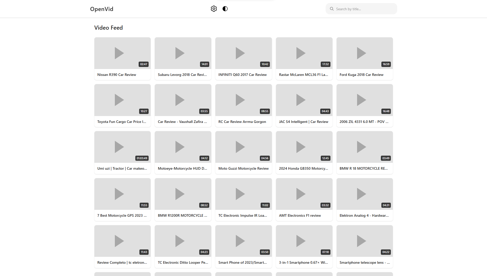

# OpenVid

> A lightweight video platform designed for older and low-powered PCs.

OpenVid is a simple, lightweight video feed focused on accessibility and performance.  
It is designed to provide a familiar video browsing experience without relying on heavy frameworks, complex build systems, or unnecessary client-side overhead.

Videos are displayed through embedded players from external platforms, while the catalog is maintained locally by the project.

## Features

- Lightweight and optimized for older PCs
- Embedded video playback from supported platforms
- Local video catalog
- English and Russian interface
- Instant video search
- Light and dark themes
- Pagination for large catalogs
- Responsive layout
- Static and easy to deploy
- GitHub Pages compatible
- Fully open source

## Running Locally

OpenVid is a static website and does not require Node.js, a database, or a server-side application.

Because the video catalog is loaded through an HTTP request, the website should be opened through a local HTTP server instead of directly through `file://`.

For example:

```bash
python -m http.server 8000
```

Then open:

http://localhost:8000
GitHub Pages

OpenVid can be deployed directly using GitHub Pages.

No build process is required.

Enable GitHub Pages in the repository settings and select the branch containing the website.

## Project Structure
index.html — main page
script.js — application logic
style.css — interface styles
res/ — project resources

# Philosophy

OpenVid is built around a simple idea:

Video websites should remain usable on older hardware.

The project intentionally avoids unnecessary dependencies and heavy client-side frameworks.

The goal is not to reproduce every feature of modern video platforms, but to provide a lightweight and comfortable way to browse and watch videos.

## Screenshots
Main Interface


Content and Third-Party Media

OpenVid is a software project and does not claim ownership of third-party videos, thumbnails, logos, trademarks, or other external content referenced by the catalog.

Videos may be embedded from external platforms. Such content is provided by third parties and remains the property of their respective owners.

OpenVid does not control the content hosted on external platforms and is not responsible for its availability, accuracy, legality, or suitability.

Users are responsible for the content they choose to access and for complying with applicable laws and the terms of the respective third-party platforms.

## License

OpenVid is free and open-source software licensed under the GNU Affero General Public License v3.0.

See LICENSE for the full license text.
